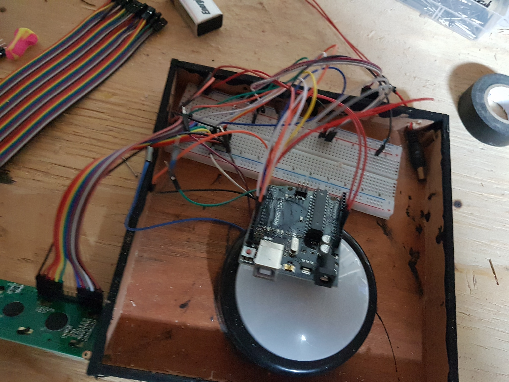

Code for a bop-it-inspired game. Built from a dollar-store push light, some LEDS and a button. Two teams compete to hit the light when it turns their team color (red or blue). A simple LCD scoreboard tallies the hits, and the game speeds up as is progresses. Light changes are in random order, and at random intervals, which makes it easy to score a point for the opponent if you're not quick enough!

